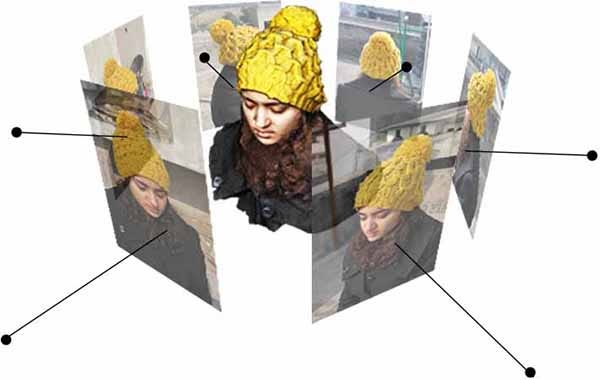
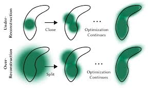

# í³„ Paper Review

  
논문 스터디와 세미나�서 발표한 �료들� 정리한 레�지토리�니다.

---

## í¾¯ Overview

### 3D Reconstruction

### Neural Radiance Fields (NeRF)

### 3D Gaussian Splatting (3DGS)

---

## í³š 세미나

| 논문 제목 | 발표 �료 | 날짜 |
|----------|----------|------|
| K-SovereignAI | [PDF](./세미나/K-SovereignAI.pdf) | 2026-01-16 |
| Resilient Sensor Fusion under Adverse Sensor Failures via Multi-Modal Expert Fusion | [PDF](./세미나/Resilient%20Sensor%20Fusion%20under%20Adverse%20Sensor%20Failures%20via%20Multi-Modal%20Expert%20Fusion.pdf) | 2025-10-22 |

## í³– 스터디

| 논문 제목 | 발표 �료 | 날짜 |
|----------|----------|------|
| MVSplat | [PDF](./스터디/mvsplat.pdf) | 2026-02-12 |
| PixelSplat | [PDF](./스터디/PixelSplat.pdf) | 2026-01-09 |
| MobileR2L | [PDF](./스터디/MobileR2L.pdf) | 2025-12-05 |
| MeRF | [PDF](./스터디/MeRF.pdf) | 2025-11-28 |
| MegaNeRF | [PDF](./스터디/MegaNerf.pdf) | 2025-09-19 |
| Depth-Supervised NeRF | [PDF](./스터디/Depth-Supervised%20NeRF.pdf) | 2025-08-28 |

---

**Repository:** [Paper-Review](https://github.com/YeonUk-Kim0120/Paper-Review.git)

