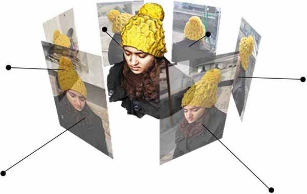
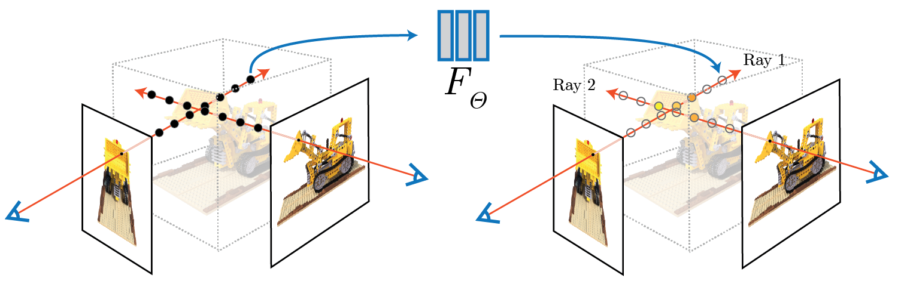
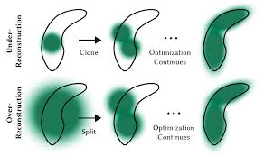

# Paper Review

  
논문 스터디와 세미나에서 발표한 자료들을 정리한 레포지토리입니다.

---

## Overview

|                               3D Reconstruction                                |               Neural Radiance Fields (NeRF)                |                3D Gaussian Splatting (3DGS)                |
| :----------------------------------------------------------------------------: | :--------------------------------------------------------: | :--------------------------------------------------------: |
|  |  |  |

---

## 발표 목록

| 논문 제목                                                                           | 발표 자료                                                                                                                   | 세미나/스터디 | 날짜       |
| ----------------------------------------------------------------------------------- | --------------------------------------------------------------------------------------------------------------------------- | ------------- | ---------- |
| BundleSDF: Neural 6-DoF Tracking and 3D Reconstruction of Unknown Objects          | [PDF](./스터디/BundleSDF_PDF.pdf)                                                                                           | 스터디        | 2026-04-09 |
| FoundationPose: Unified 6D Pose Estimation and Tracking of Novel Objects           | [PDF](./세미나/FoundationPose_ppt.pdf)                                                                                       | 세미나        | 2026-03-26 |
| 6DOPE-GS: Online 6D Object Pose Estimation using Gaussian Splatting                | [PDF](./스터디/6DOPE-GS.pdf)                                                                                                 | 스터디        | 2026-03-12 |
| MVSplat                                                                             | [PDF](./스터디/mvsplat.pdf)                                                                                                 | 스터디        | 2026-02-12 |
| K-SovereignAI                                                                       | [PDF](./세미나/K-SovereignAI.pdf)                                                                                           | 세미나        | 2026-01-16 |
| PixelSplat                                                                          | [PDF](./스터디/PixelSplat.pdf)                                                                                              | 스터디        | 2026-01-09 |
| MobileR2L                                                                           | [PDF](./스터디/MobileR2L.pdf)                                                                                               | 스터디        | 2025-12-05 |
| MeRF                                                                                | [PDF](./스터디/MeRF.pdf)                                                                                                    | 스터디        | 2025-11-28 |
| Resilient Sensor Fusion under Adverse Sensor Failures via Multi-Modal Expert Fusion | [PDF](./세미나/Resilient%20Sensor%20Fusion%20under%20Adverse%20Sensor%20Failures%20via%20Multi-Modal%20Expert%20Fusion.pdf) | 세미나        | 2025-10-22 |
| MegaNeRF                                                                            | [PDF](./스터디/MegaNerf.pdf)                                                                                                | 스터디        | 2025-09-19 |
| Depth-Supervised NeRF                                                               | [PDF](./스터디/Depth-Supervised%20NeRF.pdf)                                                                                 | 스터디        | 2025-08-28 |

---

**Repository:** [Paper-Review](https://github.com/YeonUk-Kim0120/Paper-Review.git)

